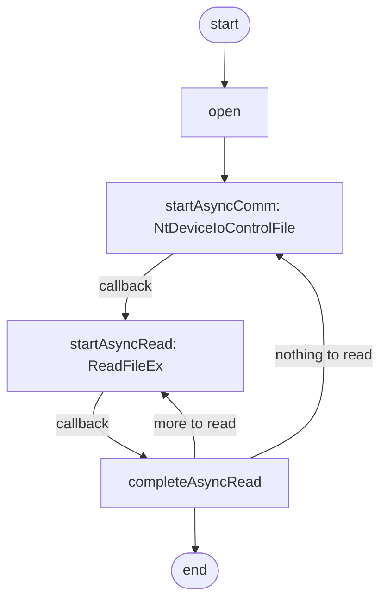

工作上的原因, 最近模仿Qt写了一个Windows下串口通信的实现, 在这过程中, 踩了不少坑, 所以写一篇文章总结一下.

首先需要明确的是, 在Windows下, 串口被抽象为文件, 对串口的读写, 实际上就是对文件的读写, 因此首先创建文件句柄.

```c++
HANDLE handle = CreateFile(
    L"COM1", 
    GENERIC_READ | GENERIC_WRITE, 
    0, 
    NULL,
    OPEN_EXISTING,
    FILE_FLAG_OVERLAPPED,
    NULL
);
```

<!--more-->

使用`CreateFile`需要`#include <Windows.h>`. 该函数的具体用法可以参考MS的官方文档, 这里要表扬一下微软, 文档写的很详细, 但如果有使用实例就更好了.
需要一提的是, 倒数第二个参数, `FILE_FLAG_OVERLAPPED`表示该文件是异步读写的, 如果设置为0, 则是只能同步读写. 

如果打开成功, 我们会获得文件句柄`handle`, 通过它, 可以对这个串口进行一系列设置, 包括波特率, 校验位等. 
```c++
DCB dcb;
bool rtn = GetCommState(handle, &dcb);
dcb.BaudRate = 115200;
dcb.ByteSize = 8;
dcb.StopBits = 0;
dcb.Parity = 0;
dcb.fParity = 0;
rtn = SetCommState(handle, &dcb);
```

设置完毕之后, 我们就要思考如何去读写了. 
我的需求是: 
1. 不设置额外的线程, 通过回调完成从串口拿回数据
2. 不关心串口是否发送完毕, 发出去就行了

所以, 写串口十分简单:
```c++
char buff[64];
PurgeComm(handle, PURGE_TXCLEAR);   //清除之前发送的数据
DWORD dwWrite = 0;
OVERLAPPED overlapped;
rtn = WriteFile(handle, buff, 64, &dwWrite, &overlapped);
```
这段代码里几乎没有什么返回值需要关心, 执行`WriteFile`也是异步的, 所以最终的发送交给操作系统了, 即使发送失败也不是代码的问题, 所以这样写就行了.

重头戏是读串口, 首先了解一下Qt是怎么做的:

<div style='display: none'>

</div>


看起来很绕, 但简单来说, 主要涉及3个步骤:
1. `startAsyncComm`:
在这个函数中, Qt调用了一个`ntdll.dll`中的一个函数`NtDeviceIoControlFile`, 它的作用是, 接收串口驱动的可读事件, 将其加入系统的apc队列. 该函数需要的参数具体可以参考[MS文档](https://docs.microsoft.com/en-us/windows/win32/api/winternl/nf-winternl-ntdeviceiocontrolfile).
值得一提的是, `NtDeviceIoControlFile`无法直接通过include头文件调用, 因为MS没有提供lib文件, 所以必须采取动态加载的方法. 这是第一个坑, 解决方法可以参考这个问题的[回答](https://stackoverflow.com/questions/10075514/calling-nt-function-from-ntdll-dll-in-win32-environment-c).
第二个坑是, 回调函数没有被调用. 这个问题是由于我没有设置CommMask.
```c++
SetCommMask(handle, EV_RXCHAR);
```
设置之后回调就正常了.
2. `startAsyncRead`:
`startAsyncRead`作为`NtDeviceIoControlFile`的回调函数在串口接收到信息后被调用. 在这个函数中, `ReadFileEx`系统函数被调用, 它的作用是, 异步读取串口数据, 其参数可以参考[MS文档](https://docs.microsoft.com/en-us/windows/win32/api/fileapi/nf-fileapi-readfileex).
文档告诉我们, `ReadFileEx`是异步的, 首先传入的文件句柄必须被设置为`FILE_FLAG_OVERLAPPED`, 这个我们已经在创建文件句柄的时候设置了, 这个没问题. 其次, 传给它的回调函数会在读到串口信息时被调用, 但因为它在`NtDeviceIoControlFile`回调函数中, 所以`ReadFileEx`被调用时, 一定是串口已经接收到数据了. 但是, 实际操作时, 我发现设置进`ReadFileEx`中的回调并没有被调用, 这是我遇到的第三个坑. 为什么呢, 我搜索了半天, 最终在CSDN的一个帖子中看到, `ReadFileEx`的回调只有当它读取到与设置参数中`bytesToRead`那么多数据后才会被调用, 经过实验, 我发现确实是这样, 但Qt源码设置的`bytesToRead`可是高达32768, 这与实际情况不符. 
最终还是因为忽略了在Qt源码中一个不起眼的调用:
```c++
COMMTIMEOUTS currentCommTimeouts;
ZeroMemory(&currentCommTimeouts, sizeof(COMMTIMEOUTS));
currentCommTimeouts.ReadIntervalTimeout = MAXDWORD;
SetCommTimeouts(handle, &currentCommTimeouts);
```
根据[MS文档](https://docs.microsoft.com/en-us/windows/win32/api/winbase/ns-winbase-commtimeouts), 当`ReadIntervalTimeout = MAXDWORD`而其他值为0时, `ReadFile`会立即返回. 实验发现`ReadFileEx`会立即调用回调. 这一切就说得通了.
3. `completeAsyncRead`:
如果我们发现我们设置的buff被写满了, 那就说明串口中有可能还有数据没有读过来, 因此需要继续调用`ReadFileEx`来读取剩下的数据. 如果读完了, 那么这次对串口的读取就结束了, 可以准备下次的读取了, 因此调用`startAsyncComm`.

现在回头看那张流程图, 是不是觉得第一步有些多余, 明明`ReadFileEx`能做到对串口读取的回调, 为什么还要引入`NtDeviceIoControlFile`呢?
我的理解是, `ReadFileEx`必须设置`bytesToRead`, 并且直到读满`bytesToRead`这么多的数据后才会去调用回调. 那么有人可能就会想到, 我把`bytesToRead`设置为1不就行了吗? 看似可行, 实际实验中造成了数据的丢失, 比如明明发送了"123456", 却只收到了"16". 丢失的行为还是随机的, 显然这样的结果是无法接受的. 

弄清了Qt的实现, 我们就可以着手写自己的了, 以下是我的实现:

```c++
#include "stdafx.h"
#include <string>
#include <Windows.h>
#include <iostream>
#include <Winternl.h>

#ifndef IOCTL_SERIAL_WAIT_ON_MASK
#  define IOCTL_SERIAL_WAIT_ON_MASK \
	CTL_CODE(FILE_DEVICE_SERIAL_PORT, 18, METHOD_BUFFERED, FILE_ANY_ACCESS)
#endif

using namespace std;

char buff[1024];
OVERLAPPED overlapped_;
HANDLE handle;
DWORD triggeredEventMask = 0;

COMMTIMEOUTS currentCommTimeouts;

typedef NTSTATUS(__stdcall *t_RtlNtStatusToDosError)(
	NTSTATUS Status
);

typedef NTSTATUS(__stdcall *t_NtDeviceIoControlFile)(
	IN HANDLE FileHandle,
	IN HANDLE Event OPTIONAL,
	IN PIO_APC_ROUTINE ApcRoutine OPTIONAL,
	IN PVOID ApcContext OPTIONAL,
	OUT PIO_STATUS_BLOCK IoStatusBlock,
	IN ULONG IoControlCode,
	IN PVOID InputBuffer OPTIONAL,
	IN ULONG InputBufferLength,
	OUT PVOID OutputBuffer OPTIONAL,
	IN ULONG OutputBufferLength
);

static void CALLBACK readDataCallback(
	DWORD dwErrorCode,
	DWORD dwNumberOfBytesTransfered,
	LPOVERLAPPED lpOverlapped
);
static VOID WINAPI qt_apc_routine(
	PVOID context,
	PIO_STATUS_BLOCK ioStatusBlock,
	DWORD reserved
);
static void CALLBACK ioCompletionRoutine(
	DWORD errorCode, DWORD bytesTransfered,
	OVERLAPPED *overlappedBase
);
static VOID WINAPI qt_apc_routine(
	PVOID context,
	PIO_STATUS_BLOCK ioStatusBlock,
	DWORD reserved
);
static void startAsyncComm();
static void startAsyncRead();

static void startAsyncRead()
{
	int rtn = ::ReadFileEx(handle, buff, 1024, &overlapped_, readDataCallback);
}

static void CALLBACK ioCompletionRoutine(
	DWORD errorCode, DWORD bytesTransfered,
	OVERLAPPED *overlappedBase)
{
	startAsyncRead();
}

static void CALLBACK readDataCallback(
	DWORD dwErrorCode,
	DWORD dwNumberOfBytesTransfered,
	LPOVERLAPPED lpOverlapped
)
{
	for (int i = 0; i < dwNumberOfBytesTransfered; i++)
	{
		cout << buff[i];
	}
	startAsyncComm();
}

static VOID WINAPI qt_apc_routine(
	PVOID context,
	PIO_STATUS_BLOCK ioStatusBlock,
	DWORD reserved)
{
	t_RtlNtStatusToDosError pfnRtlNtStatusToDosError = (t_RtlNtStatusToDosError)GetProcAddress(GetModuleHandle(L"ntdll.dll"), "RtlNtStatusToDosError");
	const DWORD errorCode = pfnRtlNtStatusToDosError(ioStatusBlock->Status);
	const DWORD bytesTransfered = NT_SUCCESS(ioStatusBlock->Status)
		? DWORD(ioStatusBlock->Information) : 0;
	const LPOVERLAPPED overlapped = CONTAINING_RECORD(ioStatusBlock,
		OVERLAPPED, Internal);

	(reinterpret_cast<LPOVERLAPPED_COMPLETION_ROUTINE>(context))
		(errorCode, bytesTransfered, overlapped);
}

static void startAsyncComm()
{	
	ZeroMemory(&overlapped_, sizeof(OVERLAPPED));

	const auto ioStatusBlock = reinterpret_cast<PIO_STATUS_BLOCK>(
		&overlapped_.Internal);
	ioStatusBlock->Status = STATUS_PENDING;

	t_NtDeviceIoControlFile pfnNtDeviceIoControlFile =
		(t_NtDeviceIoControlFile)GetProcAddress(GetModuleHandle(L"ntdll.dll"), "NtDeviceIoControlFile");
	const NTSTATUS status = pfnNtDeviceIoControlFile(
		handle,
		NULL,
		qt_apc_routine,
		reinterpret_cast<PVOID>(ioCompletionRoutine),
		ioStatusBlock,
		IOCTL_SERIAL_WAIT_ON_MASK,
		NULL,
		0,
		&triggeredEventMask,
		sizeof(DWORD));
}

int main()
{
	handle = CreateFile(L"COM1", GENERIC_READ | GENERIC_WRITE,
		0, NULL, OPEN_EXISTING,
		FILE_ATTRIBUTE_NORMAL | FILE_FLAG_OVERLAPPED,	// 0为同步，FILE_ATTRIBUTE_NORMAL | FILE_FLAG_OVERLAPPED为异步
		NULL);
	cout << "handle: " << handle << endl;
	DCB dcb;
	int rtn;
	rtn = GetCommState(handle, &dcb);

	dcb.BaudRate = 115200;
	dcb.ByteSize = 8;
	dcb.StopBits = 0;
	dcb.Parity = 0;
	dcb.fParity = 0;

	rtn = SetCommState(handle, &dcb);
	::ZeroMemory(&currentCommTimeouts, sizeof(currentCommTimeouts));
	currentCommTimeouts.ReadIntervalTimeout = MAXDWORD;
	rtn = ::SetCommTimeouts(handle, &currentCommTimeouts);
	rtn = ::SetCommMask(handle, EV_RXCHAR);
	startAsyncComm();
	
	while (true)
	{
		SleepEx(INFINITE, true);
		cout << "recv data!" << endl;
	}
	

	return 0;
}

```

代码其实不长, 但其中的坑却不少, 而且不是很容易解决, 很多问题不是很容易搜索出来, 必须自己去精准地定位问题然后自己查文档, 花了我不少时间, 不过最终跑通了还是小有成就感的.

2020/07/15